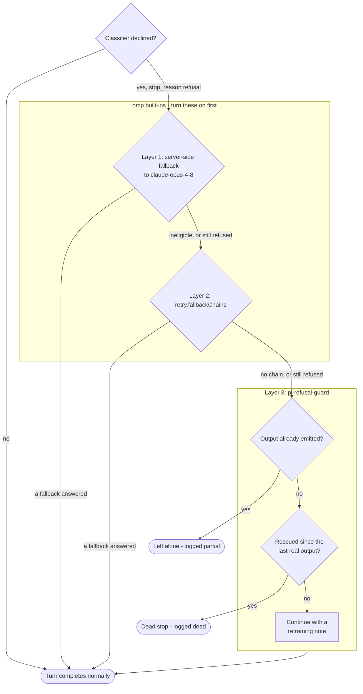
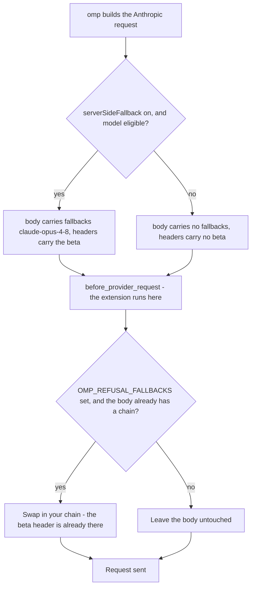

# pi-refusal-guard

A Claude safety-classifier refusal shouldn't kill your turn.

An extension for [Pi](https://pi.dev) / [OMP (Oh My Pi)](https://github.com/can1357/oh-my-pi).

## The problem

Claude Fable 5, Mythos 5 and Opus 5 run real-time safety classifiers. When one
declines, the API returns **HTTP 200** with `stop_reason: "refusal"` and a
`stop_details.category` — most often `cyber`, which
[Anthropic documents as firing on benign cybersecurity work](https://platform.claude.com/docs/en/build-with-claude/refusals-and-fallback).

omp classifies that as a retryable error, but the retry only proceeds *if a
fallback model was actually applied*. With no fallback chain configured, the
chain ends without even emitting a retry: the assistant turn has no content, and
the agent just stops. Ask a security question, watch the harness die.

Other providers do the same thing under different names — Google's
`promptFeedback.blockReason`, OpenAI's `content_filter` — and land in the same
place: a turn with nothing in it. See [Provider coverage](#provider-coverage).

## What this adds

| | |
|---|---|
| **Rescue** | A refused turn that produced *no output* and that nothing else recovered gets one continuation carrying a reframing note, instead of a silent dead stop. |
| **Telemetry** | Every refusal is appended to a JSONL log. `/refusals` reports which categories and models are tripping, and how often a fallback saved the turn. |
| **Retarget** | Rewrites Anthropic's server-side `fallbacks` chain so you choose the target models instead of the hardcoded default. |

The rescue note reframes the task honestly — it states which category fired and
asks the agent to restate the work in concrete defensive terms or say plainly
what it cannot do. It does not try to defeat the classifier.

Two deliberate limits on the rescue:

- **Empty refusals only.** Anthropic can refuse *mid-stream*, after the model has
  already emitted text or started a tool call. That turn is not a silent stop —
  you can see what happened — and re-prompting risks duplicating work or
  stranding a tool call. Those are logged as `partial` and left alone. Thinking
  blocks don't count as output, so a think-then-refuse turn is still rescued.
- **One rescue until real output.** The counter is cleared by a turn that
  actually produces something, *not* by a turn boundary — a rescue continuation
  may open a turn of its own, so a turn-scoped guard would reset itself and let
  a persistently-refusing model loop.

## How a refusal flows

Three layers. The first two are omp's own and handle most refusals; this
extension covers what falls through.



Without the extension, everything that falls out of layer 2 ends the turn with
no output and no explanation.

One asymmetry worth knowing: a layer-2 recovery *is* recorded, because omp
surfaces the refused message before it retries. A layer-1 recovery is not —
Anthropic retries inside a single API call and returns one message whose stop
reason is already normal, so no client-side tool can see that a refusal
happened. If you want `/refusals` to show the full picture, lean on
`retry.fallbackChains`.

## Provider coverage

Claude is the case this was built for, but the rescue and the log are not
Anthropic-specific.

| Provider | Detected how | Category recorded |
|---|---|---|
| Anthropic | `stopDetails.type` is `refusal` or `sensitive` | the real one — `cyber`, `bio`, `frontier_llm`, … |
| Google | omp's `ContentBlocked` error flag, set from `promptFeedback.blockReason` | `content-blocked` |
| OpenAI (Responses) | same flag, set from `incomplete: content_filter` | `content-blocked` |
| OpenAI (chat completions) | error text, since that path reports `finish_reason: content_filter` with no flag | `content-blocked` |
| Anything else omp flags as content-blocked | the same flag | `content-blocked` |

Only Anthropic reports a *named* category, so only Claude refusals give
`/refusals` a meaningful category breakdown. Everything else is recorded with
its provider error text as the explanation.

**Retarget is Anthropic-only** and always will be — `fallbacks` is a parameter
of Anthropic's server-side-fallback beta, with no equivalent elsewhere. Rescue
and telemetry are the cross-provider parts.

## Install

```bash
# Pi
pi install npm:pi-refusal-guard

# OMP (Oh My Pi)
omp plugin install npm:pi-refusal-guard
```

Straight from git, without npm:

```bash
pi install git:github.com/LoneExile/pi-refusal-guard
```

Or drop `extensions/refusal-guard.ts` into `~/.pi/agent/extensions/` or
`~/.omp/agent/extensions/`.

Restart the agent (or open a new session) after installing.

## Configure first (this matters)

omp already ships two fallback mechanisms. Turn them on — this extension
complements them, it does not replace them.

```yaml
# ~/.omp/agent/config.yml
providers:
  anthropic:
    # Server-side: one round trip, Anthropic retries the refused request on
    # claude-opus-4-8. Only applies to Fable 5 / Mythos 5.
    serverSideFallback: true

retry:
  modelFallback: true
  fallbackChains:
    # Client-side: covers Opus 5 too, and any provider.
    anthropic/claude-fable-5:
      - anthropic/claude-opus-4-8
    anthropic/claude-mythos-5:
      - anthropic/claude-opus-4-8
    anthropic/claude-opus-5:
      - anthropic/claude-opus-4-8
```

With those set, most refusals are handled before this extension is needed. It
covers what is left: the refusal that the whole chain declined, and the question
of what is tripping in the first place.

## Settings

All optional, read from the environment at load. Each is accepted under either
prefix — `OMP_REFUSAL_*` or `PI_REFUSAL_*` — so the same package configures
cleanly on either harness.

| Variable | Default | Effect |
|---|---|---|
| `…_REFUSAL_RESCUE` | `on` | Set to `off`/`0`/`false`/`no` to disable the continuation. |
| `…_REFUSAL_FALLBACKS` | *(unset)* | Comma-separated model ids replacing the server-side chain, e.g. `claude-opus-4-8,claude-sonnet-5`. Max 3 (Anthropic's limit). |
| `…_REFUSAL_LOG` | `~/.refusal-guard/refusals.jsonl` | Where refusals are recorded. One log for both harnesses, so everything lands in one place regardless of which agent hit it. |

## Commands

| Command | Effect |
|---|---|
| `/refusals` | Report categories, models, outcomes and the five most recent refusals. |
| `/refusals on` \| `/refusals off` | Toggle the rescue for this session. |
| `/refusals clear` | Delete the log. |

## Why retarget is rewrite-only

`OMP_REFUSAL_FALLBACKS` only takes effect on a request that **already carries** a
`fallbacks` array — that is, when `providers.anthropic.serverSideFallback` is on
and the model is Fable 5 or Mythos 5.

This is deliberate. The `server-side-fallback` beta header is assembled from the
request options *before* the `before_provider_request` hook runs. A `fallbacks`
array injected where none existed would be sent without its beta header and
rejected by the API. Verified against a live request:

```
{"model":"claude-fable-5","fallbacks":[{"model":"claude-opus-4-8"}]}
{"model":"claude-sonnet-5","fallbacks":null}
```



The hook runs after the headers are fixed. So: enable the built-in flag to get
the header and the default chain, and this swaps in the models you picked.

## Development

```
npm install
npm run typecheck
npm test
```

Tests drive the extension through a fake `ExtensionAPI` — no omp install, no
network.

## License

MIT
